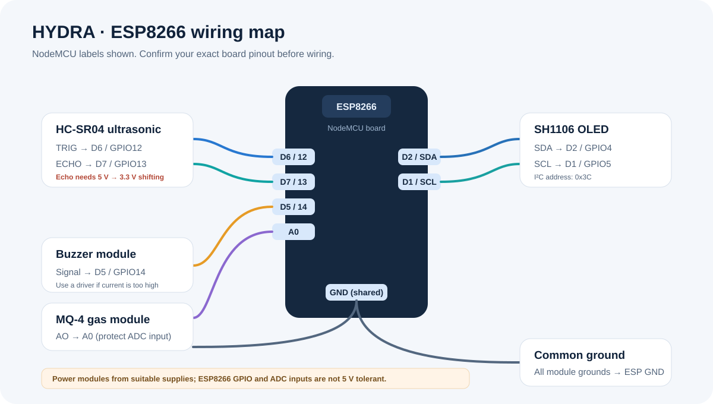

# HYDRA wiring and pin modes

This reference uses a NodeMCU-style ESP8266 board. Check the labels on your board before wiring; board variants can differ.

| Connection | NodeMCU | GPIO / peripheral | Direction |
| --- | --- | --- | --- |
| HC-SR04 TRIG | D6 | GPIO12 | Output |
| HC-SR04 ECHO | D7 | GPIO13 | Input (through a 5 V to 3.3 V level shifter/divider) |
| Buzzer signal | D5 | GPIO14 | Output |
| MQ-4 AO | A0 | ADC | Analog read |
| OLED SDA | D2 | GPIO4 / I²C SDA | I²C |
| OLED SCL | D1 | GPIO5 / I²C SCL | I²C |

## Digital pin modes in the sketch

- `OUTPUT`: the microcontroller controls the signal. Used for TRIG and buzzer.
- `INPUT`: the microcontroller samples a digital signal. Used for ECHO.
- Analog: `analogRead(A0)` measures the MQ-4 module's voltage. Check the board-specific A0 maximum before connecting it.
- I²C: `Wire.begin()` initializes the OLED bus on the board's I²C pins.

All modules need a shared ground. Never put 5 V on an ESP8266 GPIO. Use a suitable supply for the MQ-4 heater and protect the board's A0 input as required by its exact design.

